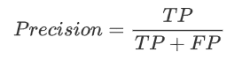
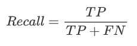
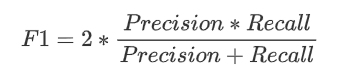
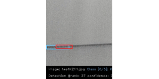
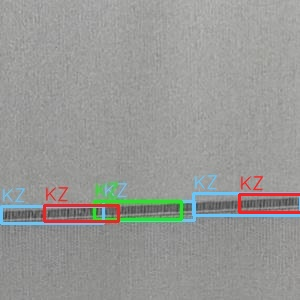
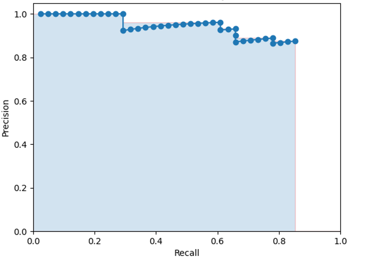
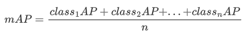

# mAP计算


### 引言

​		对于目标检测相关文献都会告诉你它结果的mAP为多少，以及Precision、Recall、F1、TP、FP、FN，但就是不讲清楚到底该怎么计算，应该先算什么再算什么，以及在项目中应该怎么自己写对应的代码。就算网上有很多的教程，但是也没有一个具体例子，所以这里将会用一个例子去说明这些详细的计算过程，并结合相关的代码进行一一解释。

### 1. 文件介绍

**Note：** 

​		VOC 数据的 mAP 的计算大部分都是采用 [Cartucho](https://github.com/Cartucho/mAP) 的代码来进行计算的，如果要想自己仔细了解的话，可以去学习一下，其代码文件的主要结构：

```
--inputs:
	--detection-results 				# 测试集对应的预测结果
	--ground-truth 					# 测试集对应的真实标签
	--images-optional   				# 测试集 
	
--scripts/extra:					# 下面的文件为
	--README.md					# 详细介绍了下面文件的作用，这里不一一说明了
	--class_list.txt
	--convert_dr_darkflow_json.py
	--convert_dr_yolo.py
	--convert_gt_xml.py
	--convert_gt_yolo.py
	--convert_keras-yolo3.py
	--find_class.py
	--intersect-gt-and-dr.py
	--result.txt
	
--main.py                               		# 计算 TP，FP，Precision，Recall，F1，mAP
```

​		**但在这里因为某些的需要，我们采用 [bubbliiiing](https://github.com/bubbliiiing) 以前根据上述代码加以实现的代码来进行讲解，但是计算mAP的过程都是以一样的。他的代码主要包含三个文件：**

```
get_dr_txt.py:  # 获得测试集的每个数据的检测结果，并保存在相应的txt文件中
get_gt_txt.py   # 获得测试集的每个数据的真实信息，并保存在相应的txt文件中
get_map.py      # 根据上面的信息，计算TP，FP，Precision，Recall，F1，mAP，该python文件与上面大神的main.py内容基本相同
```

​						 	***！！！！！最近他的代码更新了 ！！！！！(2021-10-17)***

数据示例：

```txt
detection-results: dr_test1.txt,...,dr_testn.txt            # get_dr_txt.py 得到的结果，也就是网络检测结果

	==>test1.txt: class1 0.9994 94 43 200 65				
		      class1 0.7313 151 42 230 62

ground-truth: gt_test1.txt,...,gt_testn.txt  		    # get_gt_txt.py 得到的结果

	==>test1.txt: class1 1 56 52 70                     # 这里有 4 个真实框对应的类别都是同一类别
		      class1 51 51 124 67       	    # 注意：通常一个物体只会有一个真实框，这里为了方便讲解
		      class1 219 41 300 60
		      class1 124 45 219 63
				  
images-optional: test1.jpg,...,testn.jpg                    # test1.jpg 对应的类别就是class1
```


### 2.  知识补充

------

```TP（True Positives）：  真的正样本 = 【正样本 被正确分为 正样本】```

```TN（True Negatives）：真的负样本 = 【负样本 被正确分为 负样本】```

```FP（False Positives）：  假的正样本 = 【负样本 被错误分为 正样本】```

```FN（False Negatives）：假的负样本 = 【正样本 被错误分为 负样本】```


```Precosion: 通俗的讲，就是 --> 检测结果为正样本中，真正为正样本的所占比例。 ```

<div align=center>

</div>

```Recall: 通俗的讲，就是 --> 在所有正真为正样本的数据中，被检测出是正样本的比例。 ```

<div align=center>

</div>

```F1: 是统计学中用来衡量二分类（或多任务二分类）模型精确度的一种指标。它同时兼顾了分类模型的 Precosion 和 Recall。F1分数可以看作是模型准确率和召回率的一种加权平均，它的最大值是1，最小值是0，值越大意味着模型越好。   ```

<div align=center>

</div>

##### **```AP 和 mAP 将会在后面的例子中详细说明```**


### 3. 代码解读

```get_map.py```

#### (1).  从每个测试集所对应的  *gt_test.txt*  获取每个测试集的真实框和类别信息，并保存到相应的 *_ground_truth.json*  文件中

------

结果数据示例：上述的数据示例从 **gt_test1.txt** 中获取真实框信息 保存到 **test1_ground_truth.json**

```与最最初的区别就是：添加了一些关键字，数据信息还是原来的，最关键对的是 used 关键字，它代表真实框有没有与之匹配的先验框！！！```

```json
test1_ground_truth.json:

			 [{"class_name": "class1", "bbox": "1 56 52 70", "used": false}, 
     		          {"class_name": "class1", "bbox": "51 51 124 67", "used": false}, 
     			  {"class_name": "class1", "bbox": "219 41 300 60", "used": false}, 
     			  {"class_name": "class1", "bbox": "124 45 219 63", "used": false},...]
```

-------

```python
for txt_file in ground_truth_files_list:
    #print(txt_file)
    file_id = txt_file.split(".txt", 1)[0]
    file_id = os.path.basename(os.path.normpath(file_id))
    # check if there is a correspondent detection-results file
    temp_path = os.path.join(DR_PATH, (file_id + ".txt"))
    if not os.path.exists(temp_path):
        error_msg = "Error. File not found: {}\n".format(temp_path)
        error_msg += "(You can avoid this error message by running extra/intersect-gt-and-dr.py)"
        error(error_msg)
    lines_list = file_lines_to_list(txt_file)
    # create ground-truth dictionary
    bounding_boxes = []
    is_difficult = False
    already_seen_classes = []
    for line in lines_list:
        
    ......
    
    # dump bounding_boxes into a ".json" file
    new_temp_file = TEMP_FILES_PATH + "/" + file_id + "_ground_truth.json"
    gt_files.append(new_temp_file)
    with open(new_temp_file, 'w') as outfile:
        json.dump(bounding_boxes, outfile)
```


#### (2).  从测试集的所有 *dr_test\*.txt* 获取每个测试集的检测框和类别信息，并根据测试集的所有种类，为每个种类生成一个 *class\*_dr.json*文件，然后把获取的信息根据自己的类别存放到相应的 *class\*_dr.json* 文件中。

-------
结果数据示例：class1_dr.json

```简单来讲就是，把所有的检测框根据检测结果分类，并把检测结果为同一类的存储在一起！！！```

```注意：每个检测框都是单独保存的，就算是检测框属于同一个测试图片，例如下面的数据的2，3行。```

```json
class1_dr.json:

    		[{"confidence": "1.0", "file_id": "test40", "bbox": "90 0 137 300"},
                {"confidence": "0.9994", "file_id": "test7", "bbox": "94 43 200 65"},
                {"confidence": "0.9994", "file_id": "test7", "bbox": "94 43 200 65"},
                {"confidence": "1.0", "file_id": "test54", "bbox": "1 2 28 297"}, 
                {"confidence": "1.0", "file_id": "test61", "bbox": "0 -1 31 298"}, 
                {"confidence": "1.0", "file_id": "test76", "bbox": "223 6 271 302"}, 
                {"confidence": "0.9999", "file_id": "test102", "bbox": "3 164 302 186"},...]
```

------

```python
for class_index, class_name in enumerate(gt_classes):
    bounding_boxes = []
    for txt_file in dr_files_list:
        #print(txt_file)
        # the first time it checks if all the corresponding ground-truth files exist
        file_id = txt_file.split(".txt",1)[0]
        file_id = os.path.basename(os.path.normpath(file_id))
        temp_path = os.path.join(GT_PATH, (file_id + ".txt"))
        if class_index == 0:
            if not os.path.exists(temp_path):
                error_msg = "Error. File not found: {}\n".format(temp_path)
                error_msg += "(You can avoid this error message by running extra/intersect-gt-and-dr.py)"
                error(error_msg)
        lines = file_lines_to_list(txt_file)
        for line in lines:
            try:
                tmp_class_name, confidence, left, top, right, bottom = line.split()
            except ValueError:
                error_msg = "Error: File " + txt_file + " in the wrong format.\n"
                error_msg += " Expected: <class_name> <confidence> <left> <top> <right> <bottom>\n"
                error_msg += " Received: " + line
                error(error_msg)
            if tmp_class_name == class_name:
                #print("match")
                bbox = left + " " + top + " " + right + " " +bottom
                bounding_boxes.append({"confidence":confidence, "file_id":file_id, "bbox":bbox})
                #print(bounding_boxes)
    # sort detection-results by decreasing confidence
    bounding_boxes.sort(key=lambda x:float(x['confidence']), reverse=True)
    with open(TEMP_FILES_PATH + "/" + class_name + "_dr.json", 'w') as outfile:
        json.dump(bounding_boxes, outfile)
```


#### (3).  计算TP，FP，Precision......

```下面代码我删除了一些语句，因我们主要知道怎么就算相关的数据，这里的解释说明主要放在代码里！！！```

```python
"""
 Calculate the AP for each class 计算每个类别的AP
"""
sum_AP = 0.0
ap_dictionary = {}
lamr_dictionary = {}
# open file to store the output
with open(output_files_path + "/output.txt", 'w') as output_file: 
    output_file.write("# AP and precision/recall per class\n")
    count_true_positives = {}
    
    # len(gt_classes)为类别数量, 这里每次循循环一个类别，比如第一个类别是 class1
    for class_index, class_name in enumerate(gt_classes):  
        # 这里是一个字典，key为类别，value为TP的数量
        count_true_positives[class_name] = 0
        """
         Load detection-results of that class
         加载 class1_dr.json 文件中所包含的所有检测结果
        """
        dr_file = TEMP_FILES_PATH + "/" + class_name + "_dr.json"
        dr_data = json.load(open(dr_file))

        """
         Assign detection-results to ground-truth objects
        """
        nd = len(dr_data) # len(dr_data)为 对应类别为class1的所有检测框数量
        tp = [0] * nd # 创建一个长度为nd的列表
        fp = [0] * nd
        for idx, detection in enumerate(dr_data):  # 循环对应类别为class1检测框
            file_id = detection["file_id"] # 检测框对应图片的 ID，上面的示例数据有说明
            if show_animation:
                # 根据上面的ID找到对应的测试集图片
                # IMG_PATH: ./inputs/images-optional
                ground_truth_img = glob.glob1(IMG_PATH, file_id + ".*")
                #tifCounter = len(glob.glob1(myPath,"*.tif"))
                if len(ground_truth_img) == 0:
                    error("Error. Image not found with id: " + file_id)
                elif len(ground_truth_img) > 1:
                    error("Error. Multiple image with id: " + file_id)
                else: # found image
                    #print(IMG_PATH + "/" + ground_truth_img[0])
                    # Load image
                    img = cv2.imread(IMG_PATH + "/" + ground_truth_img[0])
                    
                   	# output_files_path: ./results
                    img_cumulative_path = output_files_path + "/images/" + ground_truth_img[0]
                    
                    # 判断这个路径是否是一个文件, 默认情况下都是FALSE
                    if os.path.isfile(img_cumulative_path):
                        img_cumulative = cv2.imread(img_cumulative_path)
                    else:
                        # 把上面得到测试图片，复制一份
                        img_cumulative = img.copy()
                        
                    # 给Image的底部添加一个边界
                    bottom_border = 60
                    BLACK = [0, 0, 0]
                    img = cv2.copyMakeBorder(img, 0, bottom_border, 0, 0, cv2.BORDER_CONSTANT, value=BLACK)

            # 读取上述图片ID的所包含信息 ID_ground_truth.json
            gt_file = TEMP_FILES_PATH + "/" + file_id + "_ground_truth.json"
            ground_truth_data = json.load(open(gt_file))
            ovmax = -1  # 初始化一个IOU的值
            gt_match = -1  # 存放与检测框最匹配的真实框
            # load detected object bounding-box
            bb = [ float(x) for x in detection["bbox"].split() ]
            
            # 这一步就是为了找到检测框与所对应图片中所有同类别的真实框IOU最大那个真实框
            for obj in ground_truth_data:
                if obj["class_name"] == class_name:
                    bbgt = [ float(x) for x in obj["bbox"].split() ]
                    bi = [max(bb[0],bbgt[0]), max(bb[1],bbgt[1]), min(bb[2],bbgt[2]), min(bb[3],bbgt[3])]
                    iw = bi[2] - bi[0] + 1
                    ih = bi[3] - bi[1] + 1
                    if iw > 0 and ih > 0:
                        # compute overlap (IoU) = area of intersection / area of union
                        ua = (bb[2] - bb[0] + 1) * (bb[3] - bb[1] + 1) + (bbgt[2] - bbgt[0]
                                        + 1) * (bbgt[3] - bbgt[1] + 1) - iw * ih
                        ov = iw * ih / ua
                        if ov > ovmax:
                            ovmax = ov
                            gt_match = obj

            # assign detection as true positive/don't care/false positive
            if show_animation:  # show_animation默认为True
                status = "NO MATCH FOUND!" # status is only used in the animation
            # set minimum overlap
            min_overlap = MINOVERLAP  # MINOVERLAP=0.5
            
        # ---------------------------------------------------------------------------------------------------------------- #
        # 下面会有3种情况:                                                                                                  #
        # 		1. 最好的 IoU >= min_overlap，且最匹配的真实框没有被匹配过，也即是gt_match["used"]=false，则         #
        #		   把它改为True，其相应索引位置的tp改为1，且status="MATCH!"。                                        #
        #		2. 最好的 IoU >= min_overlap，但最匹配的真实框已被匹配过，也即是gt_match["used"]=True，则其相        #
        #          应索引位置的 fp 改为1，且status="REPEATED MATCH!"。                                                       #
        #		3. 最好的 IoU < min_overlap，则其相应索引位置的 fp 改为1，且status = "INSUFFICIENT OVERLAP"。        #
        # ----------------------------------------------------------------------------------------------------------------- #
            if ovmax >= min_overlap:
                if "difficult" not in gt_match:  # 在我们的数据集，这个默认就是满足条件的
                        if not bool(gt_match["used"]):
                            # true positive
                            tp[idx] = 1
                            gt_match["used"] = True
                            count_true_positives[class_name] += 1
                            # update the ".json" file
                            with open(gt_file, 'w') as f:
                                    f.write(json.dumps(ground_truth_data))
                            if show_animation:
                                status = "MATCH!"
                        else:
                            # false positive (multiple detection)
                            fp[idx] = 1
                            if show_animation:
                                status = "REPEATED MATCH!"
            else:
                # false positive
                fp[idx] = 1
                if ovmax > 0:
                    status = "INSUFFICIENT OVERLAP"

        # -------------------------------------------------------------------------------- #
        # 中间省略了画图部分，这里下面会用列子去说明
        # -------------------------------------------------------------------------------- #
        cumsum = 0
        # 下面两个 for 循环意思就是前几个检测框中有多少个 tp，几个 fp。列表长度为检测框的数量。
        for idx, val in enumerate(fp):
            fp[idx] += cumsum
            cumsum += val
        cumsum = 0
        for idx, val in enumerate(tp):
            tp[idx] += cumsum
            cumsum += val
        #print(tp)
        rec = tp[:]
        # 计算Recall
        for idx, val in enumerate(tp):
            rec[idx] = float(tp[idx]) / gt_counter_per_class[class_name]
        #print(rec)
        prec = tp[:]
        # 计算 Precision
        for idx, val in enumerate(tp):
            prec[idx] = float(tp[idx]) / (fp[idx] + tp[idx])
        #print(prec)
			
        # 计算 AP,F1
        ap, mrec, mprec = voc_ap(rec[:], prec[:])
        F1 = np.array(rec) * np.array(prec) / (np.array(prec) + np.array(rec)) * 2
        sum_AP += ap
        ......
```

-------

```中间画图部分的动态演示过程：(这里就用了一个例子来说明)```

<div align=center>

</div>

```最终结果：```

<div align=center>

</div>

```Note：```

​			```蓝色框 --> 真实框；红色框 --> ft检测框；绿色框 --> tp检测框```

​			```如果图中画出的同类别的真实框少于测试集标签里的数量，则表明那个真实框没有匹配的检测框，所以就没有在图中画出。```

​			```画图为什么会是这样代码里有详细的实现，过程比较简单所以这里就不解释了。```

-------

**通俗的讲：**

   1. **收集测试集中每个样本的真实标签信息，并存储在对应名字的json文件中。(例如：test1_ground_truth.json)**

   2. **收集测试集的所有检测信息，并把结果根据类别存储在对应类别的json文件中。（例如：class1_dr.json）**

   3. **for  _   in   类别： # (class1, class2, class3, ...)**

      ​		**nd = len(dr_data)   # len(dr_data)为 对应类别为 class\* 的所有检测框数量**
      ​    	**tp = [0] * nd  # 创建一个长度为nd的列表**
      ​         **p = [0] * nd**

      ​		**for   _   in  len(class\*_dr.json)： # (len(class\*\_dr.json)，检测结果为 class\* 类的所有检测框)**

      ​			**得到本检测框所属的图片名称**

      ​			**for obj in ground_truth_data：\# 所属图片的所有的真实框**

      ​				**找到IOU最大的真实框**

      ​	     		**判断最好的IOU是否 > min_overlap**

      ​				**上述的三种情况**

      ​		 **前几个检测框中有多少个tp和fp**

      ​		 **for idx, val in enumerate(fp)**

      ​		 **for idx, val in enumerate(tp)**
      
      ​		 **用上面两个 for 循环生成的列表的算出不同情况下的 Recall 和 Precision，以及F1**
      
      -------
      
      
      
      #### (3).  计算mAP
      
      ​		说了那么多，怎么计算mAP呢？？？
      
      ​		对于 (2) 中的结果，最终我们每个类别都会得到一个PR曲线，也即说不同检测数量检测框对应的Precision和Recall的形成的图，这些值和 (2) 中 rec 和 prec 一致。如下图为某类别的PR曲线：
      
      
      
      
      
      ```函数实现：```
      
      **P：其实就是P-R曲线围成的阴影面积**
      
      ```python
      # 传进的rec, prec是由(2), 每个类别都会进行该操作
      def voc_ap(rec, prec):
          rec.insert(0, 0.0)  # 在列列表最前面插入 0.0
          rec.append(1.0)     # 在列表最后面插入 1.0
          mrec = rec[:]
          prec.insert(0, 0.0) # 在列列表最前面插入 0.0
          prec.append(0.0)    # # 在列表最后面插入 0.0
          mpre = prec[:]
          
      	# ----------------------------------------------------------------------- #
          # 这样做就是为了得到上图的棕色直线部分，得到的区域刚好包住 P R线          #
          # --------------------------------------------------------------------- #
          for i in range(len(mpre) - 2, -1, -1):  # 倒序枚举
              mpre[i] = max(mpre[i], mpre[i + 1]) # 当前点 = max(当前点, 后面的点)
      
          # --------------------------------------------------------------------- #
          # 主要总用就是把上面的阴影区域分成若干个小矩形                           #
          # --------------------------------------------------------------------- #
          i_list = []
          for i in range(1, len(mrec)):
              if mrec[i] != mrec[i - 1]:  # 如果横坐标不相等就包当前横坐表存放在一个列表
                  i_list.append(i)
          
          # --------------------------------------------------------------------- #
          # 数学上的积分                                                          #
          # --------------------------------------------------------------------- #
          ap = 0.0
          for i in i_list:
              ap += ((mrec[i] - mrec[i - 1]) * mpre[i])
          return ap, mrec, mpre
      ```


​	**所以 mAP：**

<div align=center>

</div>


### 推荐：

[目标检测评估指标P-R曲线、AP、mAP](https://blog.csdn.net/qq_41994006/article/details/81051150?depth_1-)

[睿智的目标检测2——mAP的概念](https://blog.csdn.net/weixin_44791964/article/details/102414522)

